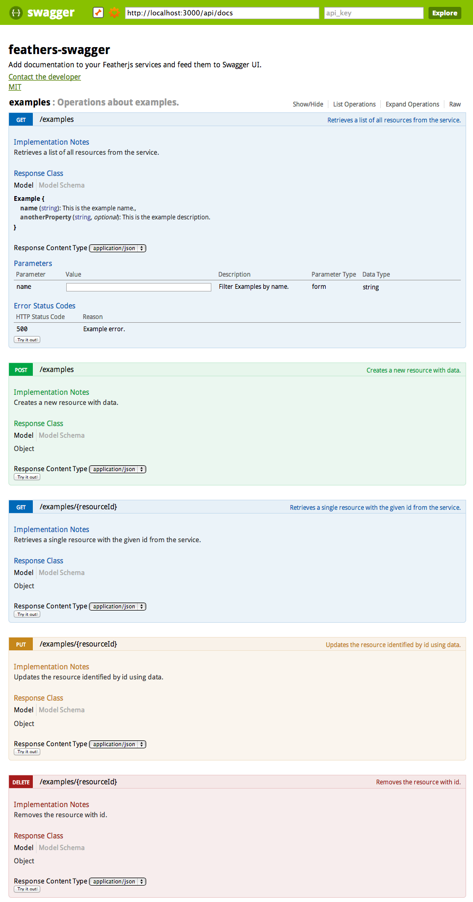

# feathers-swagger [](https://travis-ci.org/Glavin001/feathers-swagger)

> Add documentation to your Featherjs services and feed them to Swagger UI. 



## Getting Started

To install feathers-swagger from [npm](https://www.npmjs.org/), run:

```bash
$ npm install feathers-swagger --save
```

Finally, to use the plugin in your Feathers app:

```javascript
// Require
var feathers = require('feathers');
var feathersSwagger = require('feathers-swagger');
// Setup
var app = feathers();
// Use Feathers Swagger Plugin
app.configure(feathersSwagger({ /* configuration */ }));
// Add your services
```

## Example

See the [example directory](https://github.com/Glavin001/feathers-swagger/tree/master/example).

To run the example, see the [Contributing instructions below](https://github.com/Glavin001/feathers-swagger/#contributing).

## Documentation

See the [docs directory](https://github.com/Glavin001/feathers-swagger/tree/master/docs).

## Contributing

Clone this repository and run the following:

### Install Dependencies

```bash
npm install
bower install
```

### Run for Development

```bash
grunt develop
```

## Author

- [Glavin Wiechert](https://github.com/Glavin001)

## License

Copyright (c) 2014 [Glavin Wiechert](https://github.com/Glavin001)

Licensed under the [MIT license](LICENSE).
